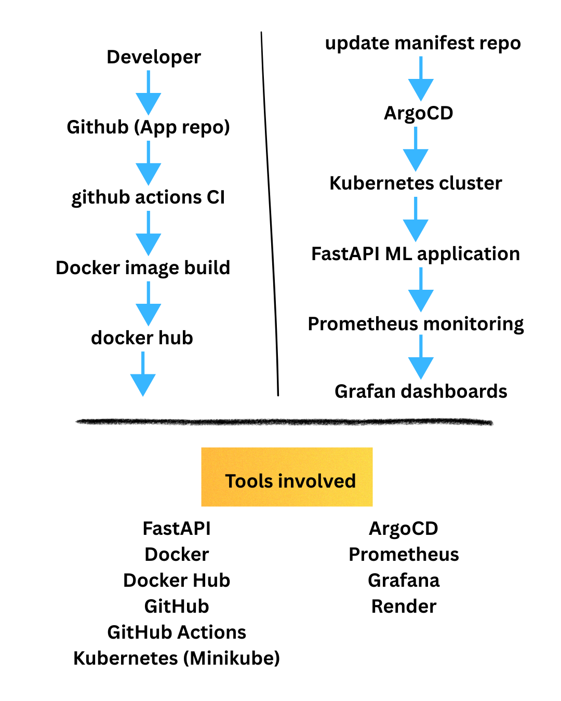
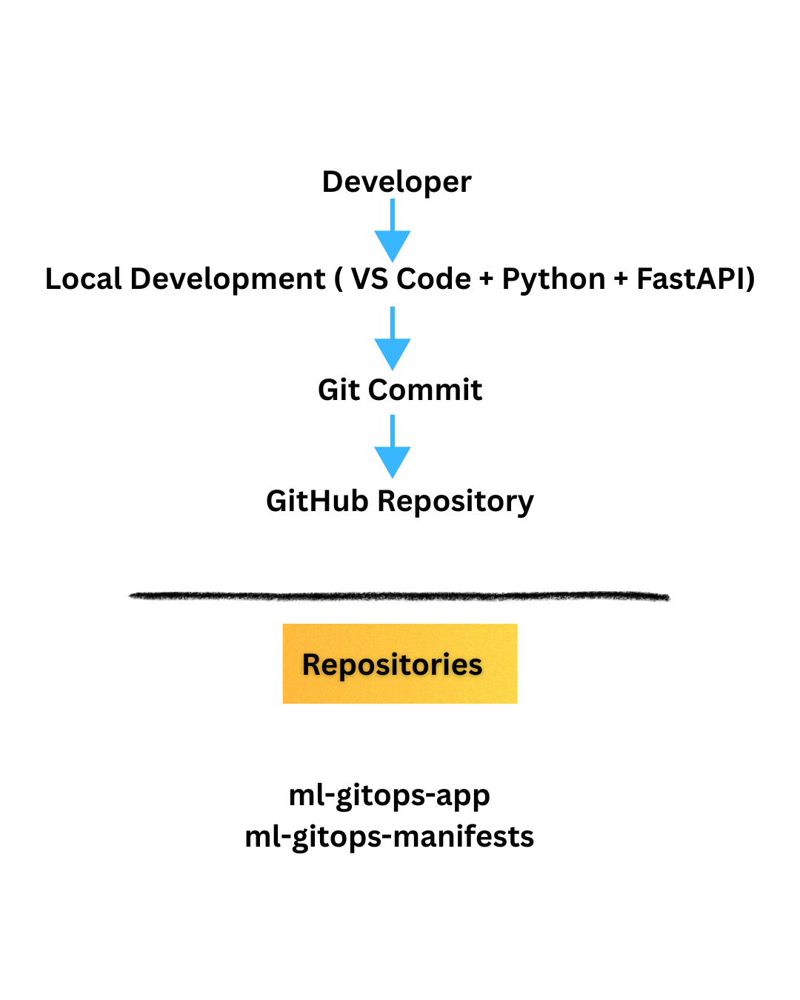
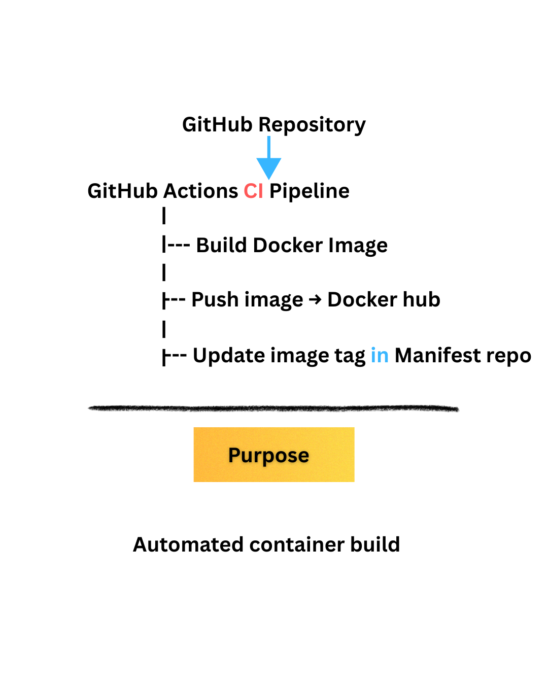
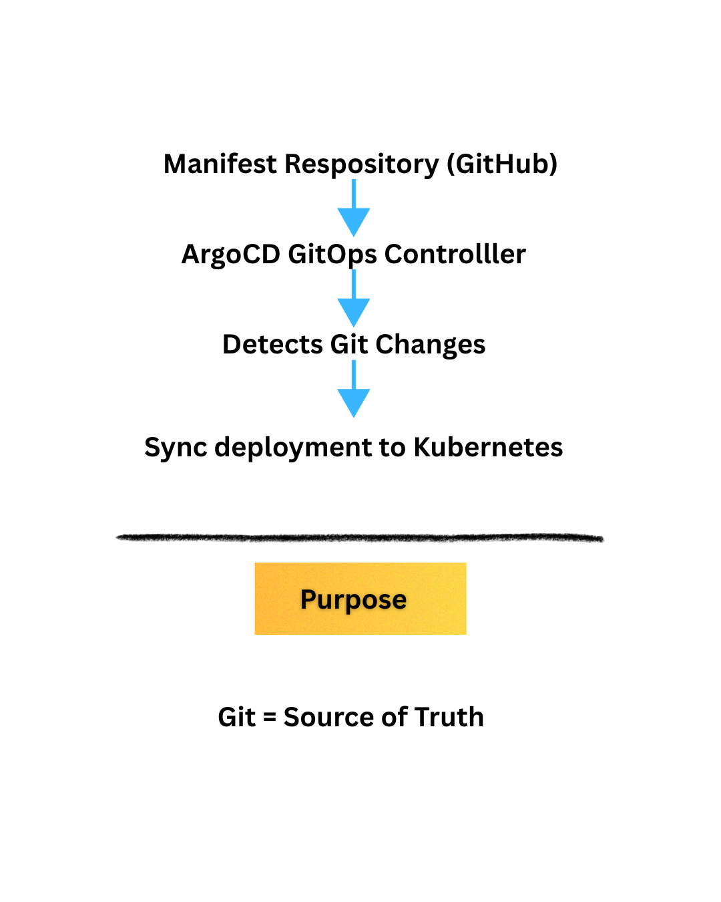
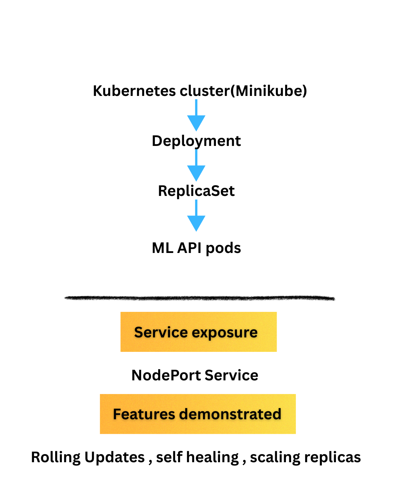
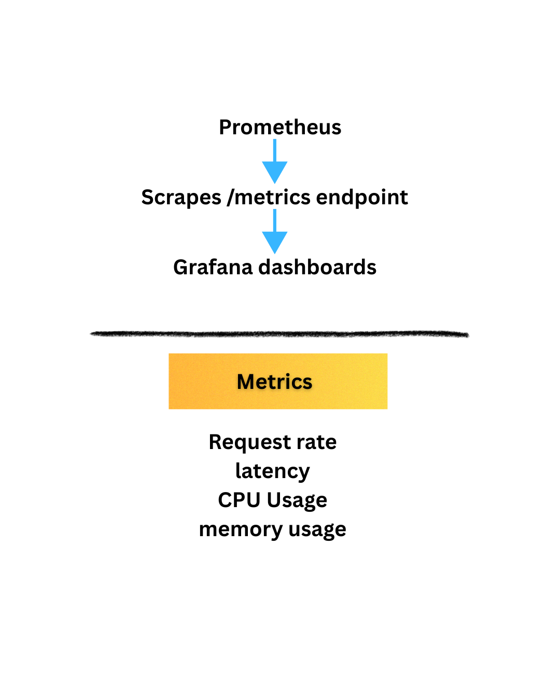
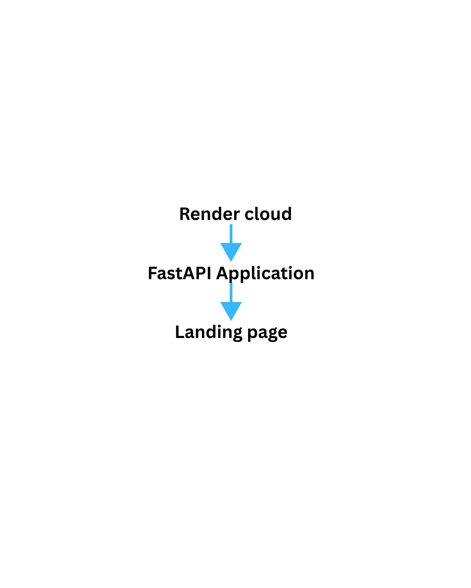

# System Architecture

This document explains the architecture of the **ML GitOps Automation Platform**.  
The system demonstrates a production-style DevOps workflow that automates container builds, GitOps deployments, Kubernetes orchestration, and monitoring.

The platform integrates multiple DevOps tools including GitHub Actions, Docker, Kubernetes, ArgoCD, Prometheus, and Grafana to create an automated end-to-end deployment pipeline.

---

# Architecture Overview

The following diagram shows the complete automation flow of the platform.

The architecture consists of multiple layers working together:

• Developer Layer  
• Continuous Integration Layer  
• GitOps Deployment Layer  
• Kubernetes Orchestration Layer  
• Observability Layer  
• Public Deployment Layer

Each layer is responsible for a specific stage of the application lifecycle.

---

# 1. Developer Layer

This layer represents the local development workflow.

### Workflow

1. Developer writes code locally using **VS Code + Python + FastAPI**
2. Changes are committed using **Git**
3. Code is pushed to the **GitHub repository**

### Repositories Used

The system follows a GitOps architecture using two repositories:

**Application Repository**

ml-gitops-app 

Contains:

- FastAPI application code
- Dockerfile
- GitHub Actions workflow

**Manifest Repository**

mlgitops-manifests

Contains:

- Kubernetes deployment manifests
- Service definitions
- ArgoCD deployment configuration

This separation follows GitOps best practices.

---

# 2. Continuous Integration Layer

The CI pipeline is responsible for automatically building container images whenever new code is pushed.

### CI Pipeline Steps

1. Developer pushes code to GitHub
2. GitHub Actions workflow is triggered
3. Docker image for the FastAPI ML application is built
4. Image is pushed to **Docker Hub**
5. The CI pipeline automatically updates the **image tag in the manifest repository**

### Purpose

Automated container builds ensure that every code change produces a deployable container image without manual intervention.

---

# 3. GitOps Deployment Layer

The GitOps layer ensures that the Kubernetes cluster always matches the desired configuration stored in Git.

### GitOps Workflow

1. Manifest repository acts as the **source of truth**
2. ArgoCD continuously monitors the repository
3. When a change is detected, ArgoCD triggers synchronization
4. Kubernetes cluster is updated automatically

### Benefits

- Version-controlled infrastructure
- Automated deployments
- Easy rollback capability
- Transparent deployment history

---

# 4. Kubernetes Orchestration Layer

This layer manages the application runtime using Kubernetes.

### Kubernetes Components

The FastAPI ML application runs using the following Kubernetes resources:

**Deployment**

Manages the desired state of application replicas.

**ReplicaSet**

Ensures the specified number of pods are running.

**Pods**

Run the containerized FastAPI ML API.

### Service Exposure

The application is exposed using a **NodePort Service**, allowing external access.

### Production Features Demonstrated

- Rolling updates
- Self-healing pods
- Replica scaling
- Zero downtime deployments

---

# 5. Observability Layer

Monitoring and observability are implemented using Prometheus and Grafana.

### Monitoring Workflow

1. Prometheus scrapes metrics from the FastAPI metrics endpoint
2. Metrics are stored inside the Prometheus time-series database
3. Grafana visualizes the metrics through dashboards

### Metrics Collected

- API request rate
- Request latency
- CPU usage
- Memory usage

These metrics help monitor system performance and detect issues.

---

# 6. Public Deployment Layer

The application is publicly accessible through a cloud deployment.

### Deployment Flow

1. Application is deployed to **Render Cloud**
2. FastAPI service runs inside the cloud environment
3. Users access the application through a public landing page

This allows the system to demonstrate real-world deployment behavior.

---

# Tools Used in the Platform

The project integrates multiple DevOps and cloud tools:

**Application Layer**

- FastAPI
- Python

**Containerization**

- Docker
- Docker Hub

**Version Control**

- Git
- GitHub

**CI/CD**

- GitHub Actions

**Container Orchestration**

- Kubernetes (Minikube)

**GitOps**

- ArgoCD

**Monitoring**

- Prometheus
- Grafana

**Cloud Hosting**

- Render

---

# End-to-End Flow Summary

The complete workflow of the system is:

1. Developer pushes code to GitHub
2. GitHub Actions builds Docker image
3. Image is pushed to Docker Hub
4. CI pipeline updates Kubernetes manifest repository
5. ArgoCD detects changes in the manifest repository
6. Kubernetes cluster is automatically synchronized
7. Application runs inside Kubernetes pods
8. Prometheus collects metrics
9. Grafana visualizes system metrics
10. Users access the application through the public endpoint

This architecture demonstrates a fully automated **GitOps-driven DevOps pipeline** for deploying a machine learning API.

---